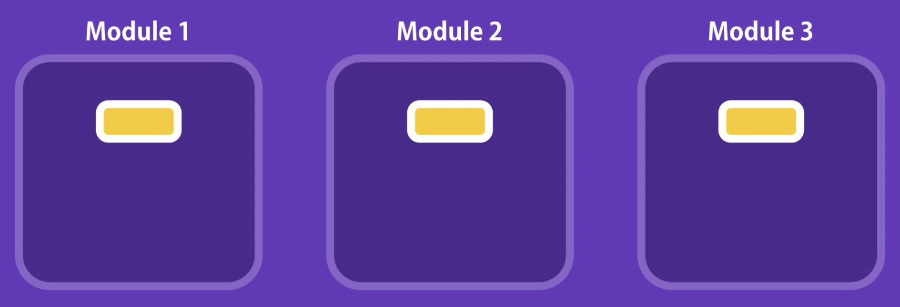

# Node Module System 

##  Global Object

```js
console.log(global);
```

```js
<ref *1> Object [global] {
  global: [Circular *1],
  clearImmediate: [Function: clearImmediate],
  setImmediate: [Function: setImmediate] {
    [Symbol(nodejs.util.promisify.custom)]: [Getter]
  },
  clearInterval: [Function: clearInterval],
  clearTimeout: [Function: clearTimeout],
  setInterval: [Function: setInterval],
  setTimeout: [Function: setTimeout] {
    [Symbol(nodejs.util.promisify.custom)]: [Getter]
  },
  queueMicrotask: [Function: queueMicrotask],
  structuredClone: [Function: structuredClone],
  atob: [Getter/Setter],
  btoa: [Getter/Setter],
  performance: [Getter/Setter],
  fetch: [Getter/Setter],
  navigator: [Getter],
  crypto: [Getter]
}
```


## Modules




> app.js: main module

```js
console.log(module);
```

```js
{
  id: '.',
  path: '/Volumes/T7 Shield/mosh-nodejs/02-Node-Module-System',
  exports: {},
  filename: '/Volumes/T7 Shield/mosh-nodejs/02-Node-Module-System/app.js',
  loaded: false,
  children: [],
  paths: [
    '/Volumes/T7 Shield/mosh-nodejs/02-Node-Module-System/node_modules',
    '/Volumes/T7 Shield/mosh-nodejs/node_modules',
    '/Volumes/T7 Shield/node_modules',
    '/Volumes/node_modules',
    '/node_modules'
  ]
}
```


## Creating a Module

```js
// logger.js
var url = 'http://logger.io/log'

function log(message) {
  console.log(message);
}

module.exports.log = log;
console.log(module);
```

 ```js
 {
   id: '.',
   path: '/Volumes/T7 Shield/mosh-nodejs/02-Node-Module-System',
   exports: { log: [Function: log] },
   filename: '/Volumes/T7 Shield/mosh-nodejs/02-Node-Module-System/logger.js',
   loaded: false,
   children: [],
   paths: [
     '/Volumes/T7 Shield/mosh-nodejs/02-Node-Module-System/node_modules',
     '/Volumes/T7 Shield/mosh-nodejs/node_modules',
     '/Volumes/T7 Shield/node_modules',
     '/Volumes/node_modules',
     '/node_modules'
   ]
 }
 ```

## Loading a Module

```js
// app.js
const loggerModule = require('./logger')
console.log(loggerModule);
loggerModule.log('hahaha')
```

```js
{ log: [Function: log] }
```

## Module Wrapper Function

```js
// MWF -- Immediately Invoked Function
// (const) exports === module.exports
(function (exports, require, module, __filename, __dirname) {
  ......
})();
```

## Path Module

```js 
const path = require('path')

const pathObj = path.parse(__filename);

console.log(pathObj);
```

```js
{
  root: '/',
  dir: '/Volumes/T7 Shield/mosh-nodejs/02-Node-Module-System',
  base: 'app.js',
  ext: '.js',
  name: 'app'
}
```

## OS Module

```js
const os = require('os')

const total = os.totalmem() / (1024*1024*1024);
const free = os.freemem() / (1024*1024*1024);

console.log(`Total Memory: ${total}\nFree Memory: ${free}`);
```

## FS Module

```js
const fs = require('fs')

const files = fs.readdirSync('.');
console.log(files);

fs.readdir('$', (err, files) => {
  if (err) console.log(`Error: ${err}`);
  else console.log(files);
})
```

## Events Module

```js
const EventEmitter = require('events');
const emitter = new EventEmitter();

// register a listener
emitter.on('message', (arg) => {
  console.log(arg)
  console.log('message listener called!')
})

// raise a events
// pass data to event listener
emitter.emit('message', {id: 1, url: 'crud.org'});
```

## HTTP Module

```js
const http = require('http');

const server = http.createServer();

const server = http.createServer((req, res) => {
  if (req.url === '/') {
    res.write('Hello Client ~')
    res.end();
  }
});

//server.on('connection', () => {
//  console.log('New Connection ...');
//});

server.listen(3000, () => {
  console.log('server listening on port 3000 ...');
})
```

#  NPM

## package.json

```json
{
  "name": "npm-demo",
  "version": "1.0.0",
  "description": "",
  "main": "index.js",
  "scripts": {
    "test": "echo \"Error: no test specified\" && exit 1"
  },
  "author": "",
  "license": "ISC"
}
```

> `npm i underscore`

```json
"dependencies": {
  "underscore": "^1.13.6"
}
```

## Using a Package

```js
const us = require('underscore')
// Core Module
// file or folder: relative path
// 3rd Party Lib: node_modules
const result = us.contains([8, 5, 4], 5);
console.log(result);
```

## Source Control

> `npm i`
>
> - download all dependencies in package.json

## Semantic Versioning

```json
"dependencies": {
  "underscore": "^1.13.6" // SemVer 
}
```

`Major.Minor.Patch`

a.b.c

- ^ --- a.x
- ~ --- a.b.x

## List Installed Package

`npm list [--depth=x]`

## Install a Spec Version

`npm i mongoose@2.4.2`

## Update a Published Package

`npm version [major | minor | patch]`

`npm publish`

## DevDependencies

 `npm i --save-dev jshint`

```json
{
  "name": "npm-demo",
  "version": "2.0.1",
  "description": "",
  "main": "index.js",
  "scripts": {
    "test": "echo \"Error: no test specified\" && exit 1"
  },
  "author": "",
  "license": "ISC",
  "dependencies": {
    "mongoose": "^8.3.2",
    "underscore": "^1.13.6"
  },
  "devDependencies": {
    "jshint": "^2.13.6"
  }
}
```

## Update Local Packages

`npm outdated # check outdated packages`

`npm update `

# RESTful API & Express

## RESTful Services

- GET /api/customers
- PUT /api/customers/1 body
- DELETE /api/customer/1
- POST /api/customers body

## Express

```js
const express = require('express')

const app = express();

app.get('/', (req, res) => {
  res.send('Hello Express~');
})

app.get('/api/courses', (req, res) => {
  res.send([1, 2, 3]);
})

app.listen(3000, () => console.log('Sever listening on port 3000'))
```

## Environmental Variables

```js
const port = process.env.PORT || 3000;
```

##  Route Parameters

```js

app.get('/api/post/:year/:month', (req, res) => {
  console.log(req.params);
  console.log(req.query);
  res.send(req.params);
})

// http://localhost:3000/api/post/1998/3?sortBy=name

/*
{ year: '1998', month: '3' }
{ sortBy: 'name' }
*/
```

## Handling HTTP GET

```js
app.get('/api/courses/:id', (req, res) => {
  const course = courses.find(c => c.id === parseInt(req.params.id));
  if (!course) // 404
  {
    res.status(404);
    res.send('Course Not Found!');
  }
  res.send(course);
})
```

## Handling HTTP POST  

```js
app.use(express.json());
app.post('/api/courses', (req, res) => {
  const course = {
    id: courses.length + 1,
    name: req.body.name
  }

  courses.push(course);
  res.send(course);
})
```

## Input Validation

```js
const Joi = require('joi')
app.post('/api/courses', (req, res) => {

  const schema = Joi.object({
    name: Joi.string().min(3).required()
  })

  const result = schema.validate(req.body);

  if (result.error) {
    res.status(400).send(result.error.details[0].message)
  }

  const course = {
    id: courses.length + 1,
    name: req.body.name
  }

  courses.push(course);
  res.send(course);
})
```

## Handling HTTP PUT

```js
app.put('/api/courses/:id', (req, res) => {
  // Lookup courses (id) -- 404 if not found
  const course = courses.find(c => c.id === parseInt(req.params.id));
  if (!course) {
    res.status(404).send('Course Not Found!');
  }
  // req validation
  const schema = Joi.object({
    name: Joi.string().min(3).required()
  })

  const result = schema.validate(req.body); 
  if (result.error) {
    res.status(400).send(result.error.details[0].message)
  }

  // Update
  course.name = req.body.name;
  res.send(course);
})
```

## Handling HTTP DELETE

```js
app.delete('/api/courses/:id', (req, res) => {
  const course = courses.find((c) => c.id === parseInt(req.params.id));
  if (!course) res.status(404).send('Course Not Exist!');

  const idx = courses.indexOf(course);
  courses.splice(idx, 1);

  res.send(courses);
});
```


